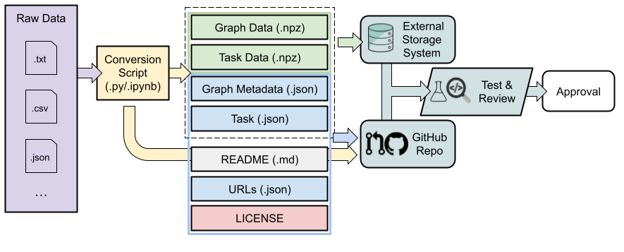

# Dataset Submission Guide

## Contribution Workflow

The workflow of contributing a new dataset is shown in the following figure. The workflow can be roughly divided into 4 steps:

- [Step 1: Convert Raw Data to Standard GLI Format](#step-1-convert-raw-data-to-standard-gli-format)
- [Step 2: Upload NumPy Data Files to Cloud Storage](#step-2-upload-numpy-data-files-to-cloud-storage)
- [Step 3: Upload JSON and Auxiliary Files to GitHub](#step-3-upload-json-and-auxiliary-files-to-github)
- [Step 4: Test, Review, and Revise](#step-4-test-review-and-revise)



## Step 1: Convert Raw Data to Standard GLI Format


### File Structure


At a high level, the GLI format consists of three types of files for each dataset, as shown in the figure above. 

- *GLI Data Storage files*: Any information in the dataset that is NOT specific to a task should be stored in these files. Examples include the graph structure and node/edge/graph attributes.
- *GLI Task Configuration files*: Any information that is specific to a task should be stored in these files. Examples include the task type, data splits, information about which node attribute serves as the node label in a node classification, or number of classes.
- *GLI Auxiliary files*: README.md, LICENSE, data conversion script, etc.


#### Separate NumPy Binary Data Files

For both *GLI Data Storage* and *GLI Task Configuration*, we essentially store the data in the form as a nested dictionary of NumPy arrays, where the format of the dictionary keys are standardized. For example, *GLI Data Storage*, we can store the node attributes of all nodes as an array of size (num_nodes, attr_dim), and store the edge list as an array of size (num_edges, 2). 

However, on the one hand, we cannot directly store the large data files in a GitHub repo; on the other hand, we want to utilize the GitHub Action and code review functionaliy to conduct automatic tests and peer-review on the submitted datasets. 

To address this problem, we propose to first store the NumPy arrays in separate NumPy binary data files (.npz files), and then replace the NumPy arrays in the nested dictionary with pointers to the corresponding .npz files.

As a result, for *GLI Data Storage*, we will have a `metadata.json` file storing the nested dictionary, and multiple `*.npz` files storing the NumPy arrays. Similarly for *GLI Task Configuration*, we will have a `task_<task_type>.json` file for each task, and multiple `*.npz` files storing NumPy arrays such as data splits.

More detailed documentation about the concrete definition of the standard GLI format can be found in [FORMAT.md](./FORMAT.md).

### Data Conversion

Concretely, one can follow the following procedure to complete the data conversion.

0. Decide your dataset name, let's call it `<name>`.
1. Construct the `metadata.json` for your dataset by filling in the blanks in `templates/template/metadata.hjson`.
2. Write code to extract the NumPy arrays needed by `metadata.json` and save them to .npz files by calling `gli.utils.save_data(prefix="<name>", **dict_of_arrarys)`, where `dict_of_arrays` should be a dictionary with values as arrays to be stored and keys as the name of each array. The keys here should correspond to the array keys specified in `metadata.json`.
3. For each task in your dataset, construct the `task_<task_type>.json` by filling in the blanks in a suitable task template under `templates/template/`.
4. Write code to extract the NumPy arrays needed by `task_<task_type>.json` and save them to .npz files by calling `gli.utils.save_data(prefix="<name>_<task_type>", **dict_of_arrarys)`. The keys in `dict_of_arrays` should correspond to the array keys specified in `task_<task_type>.json`.
5. Merge the code in 2 and 4 into a Jupyter Notebook `<name>.ipynb` or a Python script `<name>.py`.


## Step 2: Upload NumPy Data Files to Cloud Storage

Please upload the .npz files obtained in the last step to our cloud storage by visiting [this URL](tinyurl.com/glifileupload). Then you can check the download links of your uploaded .npz files at [this webpage](tinyurl.com/glifilelink). 

Please build a dictionary with each key corresponding to one .npz file and the value corresponding to the download link, and store it in a file named `urls.json`.


## Step 3: Upload JSON and Auxiliary Files to GitHub

#### Add README and LICENSE

Please write a `README.md` file for your dataset by filling in the blanks in `templates/template/README.md`. Please also generate a suitable `LICENSE` file for your dataset.

#### Create Dataset Folder

Then you can create your dataset folder `datasets/<name>` in the GLI repository. You can refer to [the tips on developing GLI](./CONTRIBUTING.md#tips-on-developing-gli) about how to start developing in the GLI repository. Your folder should contain the following files.


```
datasets/<name>
├── <name>.ipynb/<name>.py
├── README.md
├── LICENSE
├── metadata.json
├── task_<task_type>.json
├── ...  # There might be multiple task configurations.
└── urls.json
```

where `<name>` is the dataset name and `<task_type>` is one of the given tasks defined in [GLI Task Format](./FORMAT.md#gli-task-format).

- `<name>.ipynb/<name>.py`: A Jupyter Notebook or Python script that converts the original dataset into standard GLI format.
- `README.md`: A document that contains the necessary information about the dataset and task(s), including description, citation(s), available task(s), and extra required packages for `<name>.ipynb/<name>.py`.
- `LICENSE`: The license associated to the dataset.
- `metadata.json`: A json configuration file that stores the metadata of the graph dataset. See [GLI Data Format](./FORMAT.md#gli-data-format).
- `task_<task_type>.json`：A task configuration file that stores an available task on the given dataset. See [GLI Task Format](./FORMAT.md#gli-task-format). Contributors can define multiple tasks on the same dataset. If there are multiple tasks with the same task type, use `task_<task_type>_<id>.json` to distinguish them, where `<id>` should be replaced by integers 1, 2, etc.
- `urls.json`: A url configuration file that stores the downloading urls of the uploaded NumPy data files (.npz). See the [Step 2](#step-2-upload-numpy-data-files-to-cloud-storage) above for more details.


#### Local Test

You can run `make pytest DATASET=<name>` at the root of the repository to test your dataset implementation locally.

#### Open A Pull Request

Finally, please [open a pull request](https://github.com/Graph-Learning-Benchmarks/gli/pulls?q=is%3Apr+is%3Aopen) to upload your new dataset folder to the GLI repository on GitHub.

## Step 4: Test, Review, and Revise

Your pull request will be automatically tested by GitHub Actions and manually reviewed by the project maintainers or other peer researchers. Please follow the feedback from both sources to revise and improve the contributed dataset. Finally, the contributed dataset will be merged into the GLI repository after approval from peer-reviews.

