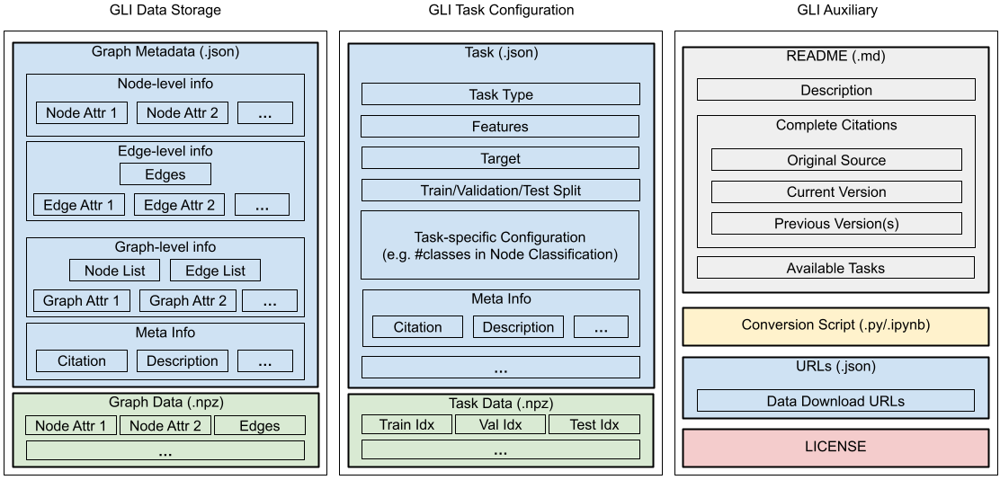

.. _format:

GLI Data and Task File Formats
==============================

Overview
~~~~~~~~
The GLI file format is designed to be a unified file format for storing graph
learning datasets, allowing a general data loading scheme through GLI. The
figure on the top gives an overview of the GLI file structure.

This section illustrates the GLI file structure through three components:

1. `GLI Data Storage`_
2. `GLI Task Configuration`_
3. `GLI Auxiliary`_

.. note:: 
    GLI provides a rich list of templates for different tasks. 

.. TODO - add links

GLI Data Storage
~~~~~~~~~~~~~~~~

Objects
^^^^^^^

GLI aims to accommodate various types of graph-structured data, such as
multi-graphs, heterogeneous graphs, dynamic graphs, or even hypergraphs, as well
as graphs with node attributes and edge attributes.

For this purpose, we treat nodes, edges, and graphs all as objects with
attributes. In particular, edges are objects with a special attribute indicating
the two end nodes; graphs are objects with a special attribute indicating the
list of nodes it contains. Treating the edges and graphs as objects with special
attributes makes it easy to extend to different types of data.

Attributes
^^^^^^^^^^

Example (Homogeneous Graph)
^^^^^^^^^^^^^^^^^^^^^^^^^^^

Example (Heterogeneous Graph)
^^^^^^^^^^^^^^^^^^^^^^^^^^^^^

GLI Task Configuration
~~~~~~~~~~~~~~~~~~~~~~

Supported Tasks
^^^^^^^^^^^^^^^

Example (Node Classification)
^^^^^^^^^^^^^^^^^^^^^^^^^^^^^

GLI Auxiliary
~~~~~~~~~~~~~

Documentation (README)
^^^^^^^^^^^^^^^^^^^^^^

Conversion Script
^^^^^^^^^^^^^^^^^

License
^^^^^^^

urls.json
^^^^^^^^^